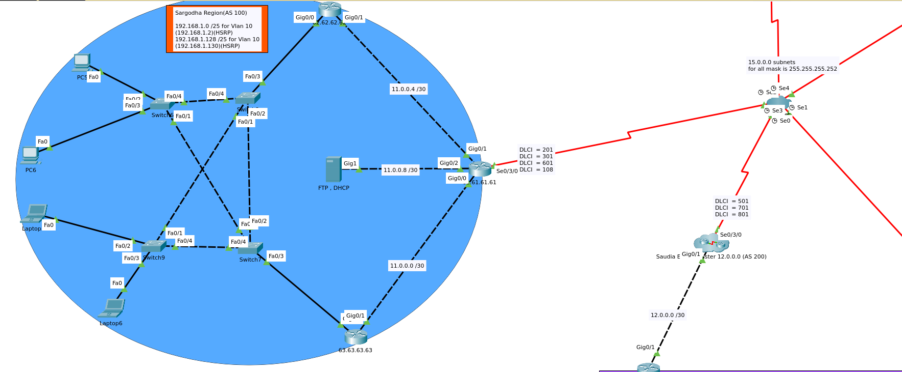

# spark-networks-CCNA

these are projects i build during learning CCNA

## 1-Campus network system
Assigned as Assignment in 3rd semester

## 2-Spark Network system 
Semester Project - Build during learning to practice new concepts and things

